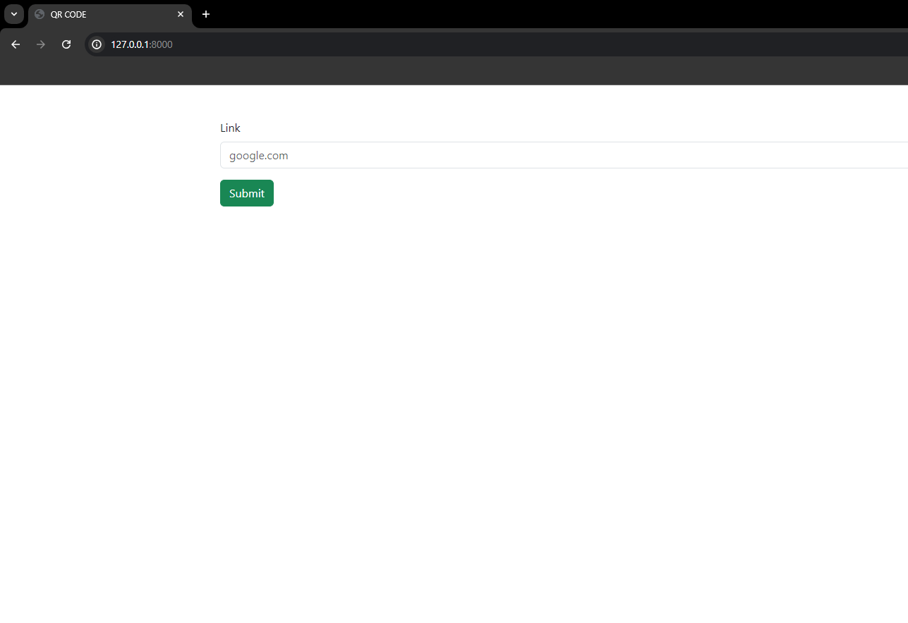
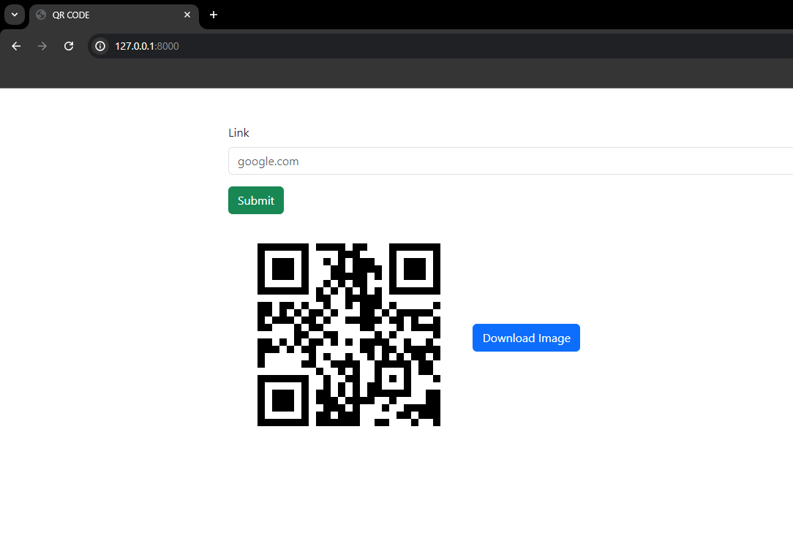
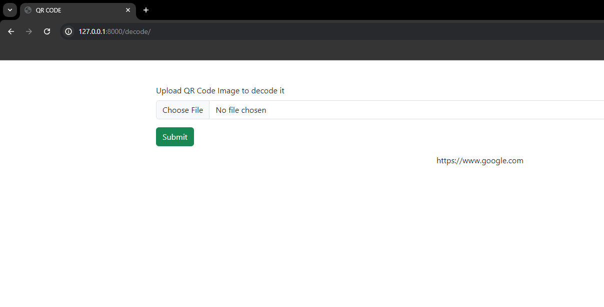

# QRCode Web App

A Django-based web application to generate and decode QR codes.

## Features

- **Generate QR Codes:** Create QR codes from text input.
- **Decode QR Codes:** Upload an image to decode the QR code and extract the embedded information.
- **User Authentication:** Secure user login and registration system.

## Screenshots

![Home Page]
![Generate QR Code]
![Decode QR Code]

## Installation

1. **Clone the repository:**
   ```sh
   git clone https://github.com/itsabdullah15/Django/QRCodeapp
